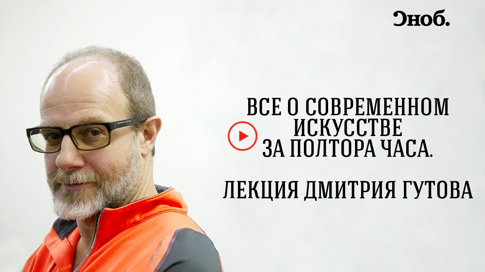
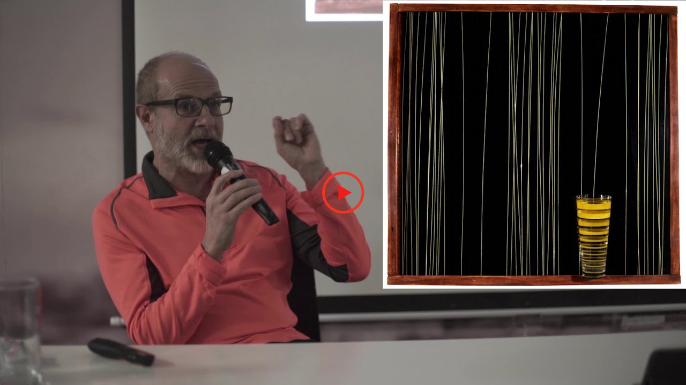

---
tags:
- russian
- books
- people
date: 2018-04-02T17:26:45Z
description: Nude & Rude Wisdom Hunger
title: Lust for life
coverart: lust\_for\_life.jpg
coveralt: Iggy Pop - In the death car, we're alive
slug: lust-for-life
---

Я долгое время думал, что же написать, и недавно меня ударила молния: то же самое, о чём я *говорю*. В [прошлой записи](/2015/language/) я упоминал эссе [Write Like You Talk](http://www.paulgraham.com/talk.html), а сегодня я расскажу ровно то, что жгло мне душу в последнее время и что я изливал на беззащитных собеседников.

Зачем человеку жить и бредить одним, а писать о другом? Уберём лишние слои, как это делал Казимир Малевич. Музыка, фильмы, книги, статьи, тренировки в аэротрубе, прыжки с парашютом и общение с прекрасным полом – вот смесь, которой дышу я.

<!--more-->
---

Говоря о Казимире, нельзя не вспомнить то, что взорвало этот мир, и при каждом упоминании чего вы можете слышать отзывы уровня "я тоже так могу" и "что это за туфта?": **современное искусство**.

Дмитрий Гутов на видео ниже в минимально возможное время рассказывает, почему прекрасно одетые люди рассматривают на выставке кучи мусора [Ильи Кабакова](https://thewallmagazine.ru/who-is-ilya-kabakov/), готовы платить миллионы за [дерьмо художника](https://www.tate.org.uk/art/artworks/manzoni-artists-shit-t07667) Мандзони и полудетские каракули [Жан-Мишель Баския](https://www.basquiat.com), и чем знамениты сделанные из стали [пластиковые надувные игрушки](http://www.jeffkoons.com/artwork/balloon-swan/balloon-swan) работы Джеффа Кунса.

Глянцевой обложке видео и блестящей лысине Дмитрий обязан журналу *Сноб*. Просто посмотрите видео, вы не пожалеете — здесь тот редкий случай, когда название абсолютно точно соответствует содержанию. Десятки интересных и забавных мыслей, из запомнившегося — рядом висящий оригинал и копия отличаются по тому, что подлинник написан хуже – где-то у автора дрогнула рука, где-то потекла краска, и это-то технически сымитировать очень сложно, если не невозможно.

Оттуда же: многотысячная очередь к [Поясу Пресвятой Богородицы](https://www.pravmir.ru/poyas-presvyatoj-bogorodicy-chudesa-foto/) в Москве даёт нам один из ключей к пониманию современного искусства: люди приходят посмотреть не на верёвку (гораздо более новую и прочную вы можете купить в любом хозяйственном магазине), а на объект религиозного поклонения, за которым они видят две тысячи лет христианской истории.

Многие неглупые люди говорили о том, что нельзя смотреть на искусство без контекста ([вот из недавнего](https://www.youtube.com/watch?v=x7Ilf1mAZCk&t=2800s), и это касается не только _современного_ искусства!), и я не премину повторить это. После этого и пару других видео я стал совсем по-другому смотреть на современное искусство, оно стало мне понятнее и ближе. Теперь на выставках я с удовольствием смотрю на работы прошлого (поскольку имею хотя бы общее представление о контексте, например, США 60-х или России 80-х), и с искренним интересом рассматриваю работы последних пяти-десяти лет. Суть десятилетия выкристаллизуется только через призму времени, а современные авторы уже сейчас пытаются её нащупать, и через их работы можно увидеть разные взгляды на это. У каждого из нас есть весь контекст, но ни у кого нет ключа к разгадке и доброго помощника, который скажет: вот это через тридцать лет стало стоить миллионы, а про вот это все забыли ещё при жизни автора.

Ниже ещё одно видео Гутова, на этот раз о его творчестве, такое же интересное как первое.

---

От *мягкого* к жёсткому. Стоицизм — философия, которая позволяет быть счастливым в любой ситуации. Марк Аврелий о том, что жить надо сейчас:


Если бы даже ты рассчитывал прожить три тысячи лет и еще тридцать тысяч, все же ты должен помнить, что никто не лишается другой жизни, кроме той, которую он изживает, и никто не изживает другой жизни, кроме той, которой лишается. Поэтому самая продолжительная жизнь ничем не отличается от самой краткой. Ведь настоящее для всех равно, а следовательно равны и потери – и сводятся они всего-навсего к мгновенью. Никто не может лишиться ни минувшего, ни грядущего. Ибо кто мог бы отнять у меня то, чего я не имею?
Итак, следует помнить о двух истинах. Во-первых: все от века равно самому себе, пребывая в круговороте, и потому вполне безразлично, наблюдать ли одно и то же сто лет, или двести, или же бесконечное время. Во-вторых: наиболее долговечный и умерший, лишь начав жить, теряют, в сущности, одно и то же. Настоящее – вот все, чего можно лишиться, ибо только им и обладаешь, а никто не лишается того, чем не обладает.


Ух, сколько тут всего... Первое, довольно распространённая уже во времена эллинистической философия идея "вечного настоящего", которая и сейчас время от времени находит новую жизнь у популяризаторов науки и просто краснобаев. Суть идеи в том, что "прошлое" и "будущее" лишь слова, причём довольно вредные из-за того, сколькими значениями их нагружают, а субъективная реальность человека – вечное, непреходящее настоящее.

Второе, смерть является частью природы нашего мира, таких же чудом, как и чудо рождения. Очень непростая мысль, из тех, что можно прочесть за свою жизнь десятки раз разными словами и в разных источниках, и всё равно не понять. Одни люди погибают в десять лет, другие умирают в своей постели в сто десять, таков закон природы, и нет резона роптать против него.

Третье, не стоит откладывать что-либо на потом, нужно действовать добродетельно сейчас и всегда, иметь принципы и соблюдать их сейчас и всегда, ценить каждое прожитое мгновение сейчас и всегда.

Четвёртое, практически не затрагиваемое в этом отрывке: всё преходяще. Умрёшь ты, умрёт твоё поколение, следующее за ним и следующее за ним, и не будет этому конца — какова цена славе или позору, когда и твой поклонник, и твой соперник, и ты сам завтра обратитесь в прах?

Всю свою сознательную жизнь я жил во многом согласно философии стоицизма, но только теперь нашёл возможность начать читать книги о ней — странное чувство, когда ты делаешь первые шаги по дороге, начало которой лежит в четвёртом веке до нашей эры. Стоицизм требует удивительно мало пояснений для осовременивания, поскольку создавшие и продвигавшие её ребята всё уже неплохо продумали.

Вы наверняка слышали о том, что из неё многое взяло христианство. Интересный факт, который вам может пригодиться: четыре добродетели стоиков (**разумность**, **умеренность**, **справедливость** и **доблесть**) христианство дополнило тремя своими, **верой**, **надеждой** и **любовью**. _Вера_ интересна в том контексте, что они ни при каких условиях не могла бы стать добродетелью стоика. Она значит "выключи голову и верь кому-то или чему-то безусловно", когда _разумность_ стоика среди прочего включает [мудрость](https://waitbutwhy.com/2014/10/religion-for-the-nonreligious.html), понимание границ своего знания и незнания.

Недавно благодаря Горькому ([пароходу](https://gorky.media/context/gorkij-imeni-gorkogo-parohod-zavod-i-krejser/), не человеку, но об этом ниже) я прочёл [книгу](https://www.litres.ru/massimo-piluchchi/kak-byt-stoikom-antichnaya-filosofiya-i-sovremennaya-zhi/) "Как быть стоиком: Античная философия и современная жизнь", которую и рекомендую тем, кто хотел бы познакомиться со стоицизмом.

Главная её ценность книги — несколько практических пунктов, как практиковать стоицизм в жизни, и выжимка основных постулатов и большое количеством пояснений к требующим толкования моментам (например, про *единство с природой*, которая совсем не природа, а *природа* или скорее даже ***природа***). Также там присутствуют современные толкования примеров стоиков: ты разговариваешь о кинозвёздах, а не гладиаторах (а это признак небольшого ума, и не стоит тратить на это своё время), и вместо лампы у тебя крадут телефон (и по этому поводу нет смысла горевать).


Природа человека по мнению стоиков и других античных мыслителей принципиально отличается от природы животных: у нас другие когнитивные и социальные способности, которым мы должны соответствовать.

---

[<svg x="0px" y="0px" viewBox="0 0 166 44.8">
  <g>
    <path d="M6.5,0h25.2c0,0-0.9,4.8-1.3,6.8c-0.4,1.9-2.1,2.1-2.9,2.1c-0.8-0.1-5.2-0.4-5.2-0.4L22.7,7l-6.2,0l-3.8,18.5 c0,0,1.8,0.2,1.4,2c-0.3,1.5-1,5.3-1,5.3H0l1-3.5l1.9-2.1c0,0,3.2-16.5,3.7-18.4C6.9,6.9,5.2,7,5.2,7L6.5,0z"></path>
    <path d="M39.1,22c-0.3,6.6-5.5,11.3-12.7,11.3c-6.1,0-9.3-3.3-9-8.1c0.3-6.4,5.6-11.3,12.8-11.3 C36.3,13.8,39.3,17.2,39.1,22z M26,24.3c-0.1,1.4,0.5,2,1.8,2c1.5,0,2.8-1.4,2.9-3.4c0.1-1.3-0.5-2.1-1.9-2.1 C27.1,20.8,26.1,22.6,26,24.3z"></path>
    <path d="M42.8,22.2c0.3-1.8-1.1-2-1.1-2l1-5.4c0,0,5.2-0.6,7.6-0.8c2.4-0.2,1.5,2.4,1.5,2.4h0.2 c1.9-2.1,4.6-2.5,6-2.5c5.2,0,7.3,3.7,7.1,8.1c-0.4,7.5-5.6,11.3-11.2,11.3c-1.1,0-3-0.2-4.1-1.3l-0.3,0.2c0,0-1.7,7.9-2,9.3 c-0.5,1.9-3.1,3.3-4.9,3.3c-1.8,0-5.7-0.4-5.7-0.4l1.2-4.2l1.4-1.6C39.4,38.6,42.6,23.4,42.8,22.2z M56.4,23.1 c0.1-1.4-0.6-2.2-1.8-2.2c-1.4,0-2.9,1.4-3,3.4c-0.1,1.3,0.5,2.3,1.9,2.3C55,26.6,56.3,25,56.4,23.1z"></path>
    <path d="M77.3,20.5l0.3-0.3c1.5-1.1,3.6-1.8,5.6-1.8c3.4,0,6.6,1.8,6.4,6c-0.2,4.6-4.7,8.9-12.1,8.9 c-5.5,0-10.5-2.3-9.1-8.7c0,0,0.3-1.3,0.6-2.5c0.3-1.3-1.1-1.7-1.1-1.7l1.1-5.5c0,0,6.5-0.7,8.3-0.9c1.9-0.2,2,1.2,1.7,2 C78.9,16.3,77.3,20.5,77.3,20.5z M76.7,26.2c0,0.9,0.5,1.4,1.7,1.4c1.7,0,2.8-1,2.8-2.1c0-0.8-0.5-1.4-1.8-1.4 C77.9,24,76.7,25,76.7,26.2z"></path>
    <path d="M118,26.7c0,0,0.8-3.9,1-4.9c0.2-1.3-1.2-1.7-1.2-1.7l1.1-5.3c0,0,6.4-0.7,8.5-0.8c2-0.2,1.4,2,1.4,2 l-1.7,8.9c-0.2,0.8,0,1.6,0.9,1.6c0.9,0,1.6-0.9,1.8-2.4l1.8-9.5h8.7c0,0-1.7,8.8-2,10.2c-0.3,1.4,1.3,0.9,1.3,0.9l1.3,5.1 c-2.1,1.6-5.1,2.6-7.8,2.6c-1.8,0-3.7-0.8-3.6-3.5l-0.2-0.1c-2.1,3.3-5.4,3.6-6.4,3.6C118.5,33.2,117.1,30.9,118,26.7z"></path>
    <path d="M143.3,26.7c0,0,0.8-3.9,1-4.9c0.2-1.3-1.2-1.7-1.2-1.7l1.1-5.3c0,0,6.4-0.7,8.5-0.8c2-0.2,1.4,2,1.4,2 l-1.7,8.9c-0.2,0.8,0,1.6,0.9,1.6c0.9,0,1.6-0.9,1.8-2.4l1.8-9.5h8.7c0,0-1.7,8.8-2,10.2c-0.3,1.4,1.3,0.9,1.3,0.9l1.3,5.1 c-2.1,1.6-5.1,2.6-7.8,2.6c-1.8,0-3.7-0.8-3.6-3.5l-0.2-0.1c-2.1,3.3-5.4,3.6-6.4,3.6C143.7,33.2,142.4,30.9,143.3,26.7z"></path>
    <path d="M150.9,10.9l-1-3c0,0,6.9-6,7.6-6.6c1.1-1,2-0.1,2.2,0.2c0.2,0.3,2.2,3.7,2.7,4.5 C160.4,11.3,150.9,10.9,150.9,10.9z"></path>
    <path d="M110.8,26.3c0,0-0.4-0.9-0.8-2.1c-0.5-1.3-1.2-1.2-1.2-1.2c0.5-0.9,1.5-1.8,2-2.3c0,0,2.2,0.5,3-1.1 c0.5-0.9,2.5-4.6,2.5-4.6c-1-0.6-2.7-1.1-4.3-1.1c-2.8,0-5.3,1.1-8.6,6.6c0,0,0,0.1-0.1,0.1l-1.1,0.2l0.9-4.9c0,0,0.5-1.9-1.4-1.8 c-0.8,0-8.4,0.7-8.4,0.7l-1.1,5.6c0,0,1.4,0.4,1.1,1.7c-0.2,1.3-2.1,10.7-2.1,10.7h8.7l1.4-7.3l1-0.2l1.4,4.7 c0.9,2.3,2.2,3.2,4.5,3.2c2.2,0,4.5-1,6.2-2.8l-1.9-3.6C112.1,26.1,111.3,26.1,110.8,26.3z"></path>
  </g>
</svg>](https://gorky.media/)

Великий и ужасный, моё самое большое литературное открытие последнего года. Ему я обязан своему текущему интересу к стоицизму, и наличию тем для разговора в любой компании семь дней в неделю. Дам всего пару отрывков для затравки, там же горы и горы прекрасных текстов.


Ватсон, как и мы, читатели, остается в полном недоумении, но разгадка проста: Конан Дойл этого рассказа не писал, альтернативное расследование убийства Федора Карамазова сочинил русский поклонник творчества англичанина, Сергей Борисов, указанный в качестве переводчика. Фейковый текст попал на популярный сайт lib.ru и с тех пор гуляет по интернету, вызывая у любителей детективов удивление и смех.



В порнографических фильмах всегда полно людей, которые бесконечно долго едут на машине; пар, которые тратят нереально много времени на то, чтобы зарегистрироваться в гостинице; джентльменов, которые несколько минут едут в лифте, перед тем как зайти к себе в номер; двух девиц, которые потягивают различные спиртные напитки и перебирают всякие кофточки и кружевные оборочки, прежде чем признаться друг другу, что они предпочитают заниматься любовью с женщинами, а не с мужчинами. Прямо и грубо говоря, в порнографическом фильме, прежде чем увидеть нормальный трах, вам придется просмотреть нечто похожее на рекламный ролик городского транспортного управления.



И вот мы [с Маяковским] пошли веселиться, что называется. «Веселиться» — это значит мы пошли смотреть все эти ночные дансинги, ночные всякие, ну как они назывались… ну, в общем, это кабаки и действительно, он был прав, где, например, мужчины были переодеты в женщин. Он был остроумен невероятно. Он давал каждому или каждой (как сказать — это «каждый» или «каждая», которая женщина была… мужчина, переодетый в женщину) — давал название. Каждому, вы знаете, — и так же и женщинам; вот такое меткое, здорово! И всю ночь мы так шатались — из одного кабака в другой.



В одной из статей я пытался доказать, что в русском «Сказании о Дракуле» есть несколько фрагментов, которые не следует понимать буквально. Исторический Дракула — это XV век. Румынский народ считал одной из причин того, что человек становится вампиром, переход в католичество из православия. Румыны православные, поэтому ясно, что хорошо, а что плохо. Но какова ритуальная природа этой трансформации? Православные причащаются хлебом и вином, плотью и кровью. А католики только плотью. Значит, человек, ставший католиком, не имеет права причащаться кровью Христа. Согласно логичному православному мнению, он как-то должен это компенсировать. Чем еще отмечен XV век в европейской истории? Кстати, к этому семья Дракулы имела непосредственное отношение — гуситы. Их называли «чашниками», потому что католики-гуситы требовали причастия под двумя видами, то есть и хлебом, и вином. Если бы я писал малодоказательную, но эффектную статью, я бы сказал, что «Сказание о Дракуле» — русский рефлекс полемики о крови и двух видах причастия.

---

Если вы хотите узнавать о новых книгах, которые я нашёл интересными, следить за моими рецензиями, и иметь возможность рекомендовать мне книги, добавляйтесь в друзья на [Goodreads](https://www.goodreads.com/user/show/23839983).
